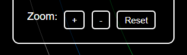
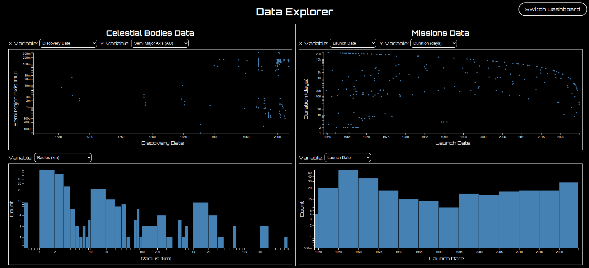
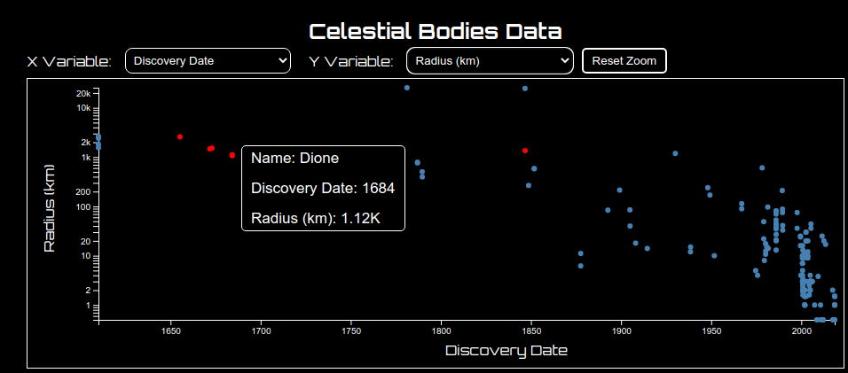
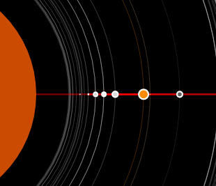
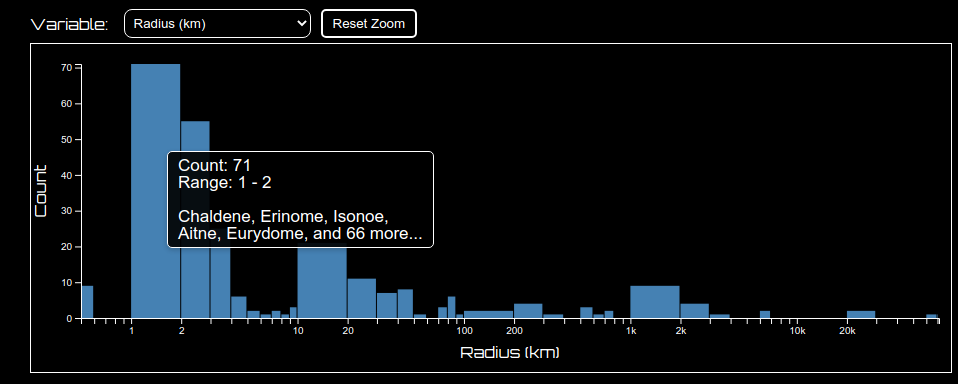

# Process Book - Solar Explorer

The "Solar Explorer" project aims to create an engaging and informative interactive visualization of space missions. By blending data from trusted sources like NASA's JPL Horizons and Jonathan C. McDowell's General Catalog of Artificial Space Objects, the tool offers an intuitive interface to explore mission trajectories, spacecraft attributes, and orbital mechanics. Through this process book, we document the design and implementation of the tool, focusing on challenges, decisions, and insights gained.

## Team Members

- Matthew Whitaker
    - email: matthew.whitaker@utah.edu
    - UID: 1251812

- Sarah Sami Khan
    - email: sarah.khan@utah.edu
    - UID: 1531711

- Simón González
    - email: u1528314@utah.edu
    - UID: 1528314

## Resources and Inspiration

This project benefited from a variety of resources that guided our design, development, and data analysis.

### Project Planning and Design

*   [Project Ideas Document](https://docs.google.com/document/d/1pG8MIJ63O_l-x5lxE9TWMq5bsQBWVphontCbd75LPDg/edit?usp=sharing)
This document outlines our initial brainstorming session, capturing the core questions and design ideas that shaped the project's direction.
*    [Project Proposal (Due Friday Sept 13)](https://www.dataviscourse.net/2024/project/#project-proposal) The formal project proposal provided a structured framework for defining our goals, data sources, and anticipated challenges.
*   [Link for data review](https://planet4589.org/space/gcat/index.html) Reviewing the available data from this source helped us understand the scope and possibilities for our visualizations.
*   **Inspirational Solar System Viewers:**
    *   [Nasa Solar System Viewer](https://science.nasa.gov/solar-system/kuiper-belt/) 
    * [Earth orbit artificial objects viewer](https://whatsin.space/) 
    * [Solar System Viewer](https://www.solarsystemscope.com/) 
    * [How to choose colors for the visualizations?](https://blog.datawrapper.de/which-color-scale-to-use-in-data-vis/)

*   **Color Scale Guidance:** [Link] This resource provided valuable insights into selecting effective color scales for data visualization.

### Development Tools and Techniques

*   **D3.js Performance Optimization:** [Render millions of datapoints with D3](https://blog.scottlogic.com/2020/05/01/rendering-one-million-points-with-d3.html) This article guided our approach to efficiently rendering a large number of data points using D3.js.
*   **Planetary Position Verification:** [Planet position calculations](https://www.fourmilab.ch/cgi-bin/Solar) We used this resource to verify the accuracy of our planetary position calculations.
*   **Planet Images:**
    *   [High-Quality Planet Images](https://codepen.io/juliangarnier/pen/krNqZO)
    *   [More planet images](https://www.solarsystemscope.com/textures/)
*   **Planetary Motion Calculations:**
    *   [Calculations Tutorial 1](https://bits.ashleyblewer.com/blog/2018/05/05/mapping-the-planets/)
    *   [Calculations Tutorial 2](https://stjarnhimlen.se/comp/tutorial.html)

These resources collectively played a crucial role in shaping our project's direction, ensuring the accuracy of our data, and guiding our implementation choices.

## Overview and Motivation

This process book chronicles the development of "Solar Explorer," an interactive visualization tool designed to captivate space enthusiasts and the general public with a deeper understanding of space mission data.  We were driven by a desire to create a more engaging and comprehensive way to explore information about space missions, going beyond traditional timelines and written milestones.

Our motivation stemmed from a few key factors:

*   **Growing Public Interest:** Public enthusiasm for space exploration has surged in recent years, fueled by scientific discoveries, high-profile missions, and initiatives like NASA's "Backyard Worlds: Planet 9" project that promote public engagement.
*   **Personal Interest:**  Our team's diverse background in astrophysics, computer science, and electrical engineering reflects a shared passion for space exploration.
*   **Untapped Potential:** We believe there's potential to enhance how space mission information is presented, incorporating details like mission paths, orbits, gravity assists, spacecraft speeds, and even the stories of mission failures.

With "Solar Explorer," we aim to provide a visually compelling and informative tool that empowers users to:

*   Explore the solar system and the missions that have ventured into its depths.
*   Gain a deeper understanding of mission trajectories, phases, and challenges.
*   Discover insights into the complexities and wonders of space exploration.

## Related Work

Existing solar system viewers, such as the NASA Solar System Viewer and the Earth orbit artificial objects viewer, provided valuable insights into effective representations of celestial bodies, orbits, and spacecraft trajectories.

### Existing Solar System Viewers

Our project drew inspiration from several existing solar system viewers, each with its own strengths and weaknesses:

*   **NASA Solar System Viewer:** While this viewer offers a wealth of information about the solar system, including accurate planetary positions and detailed data for each celestial body, its comprehensiveness can also lead to cognitive overload. The abundance of data presented may make it challenging for users to navigate effectively and discern meaningful relationships between different elements.

*   **Earth Orbit Artificial Objects Viewer:** This viewer focuses on visualizing artificial objects in Earth orbit, offering a unique perspective on the density and distribution of satellites. However, it does not include visualizations of deep space missions or detailed information about celestial bodies.

*   **Solar System Scope:** This viewer offers a more visually appealing and interactive experience, with 3D models of planets and the ability to explore different regions of the solar system. However, its focus on visual aesthetics sometimes comes at the expense of detailed information and scientific accuracy.

*   [GCAT: General Catalog of Artificial Space Objects
Jonathan C. McDowell](https://planet4589.org/space/gcat/)  While this website provides valuable data on space missions, its presentation is not visually engaging. The interface appears cluttered and text-heavy, lacking the visual clarity and intuitive exploration capabilities we aimed to achieve in our project.

## Questions

Our project's evolution was guided by a series of questions that evolved as we delved deeper into the data and design process.

### Initial Questions

We began with fundamental questions about representation and user experience:

*   **Scale and Intricacy:** How can we effectively convey the vast scale and intricate structure of the solar system in a way that is both accurate and comprehensible? This question led us to explore logarithmic scaling for distances and the careful placement of celestial bodies and their orbits.
*   **Intuitive Mission Paths:** How can we visualize the paths of space missions in an intuitive manner that highlights their complexity and key events? This question guided our exploration of different path representations, including direct paths and multi-curve paths, as well as the use of tooltips to provide detailed information on hover.

### Evolving Inquiries

As we progressed, our questions became more specific and data-driven:

*   **Mission Milestones:** What are the significant milestones of each mission, and how can we effectively highlight these events within the visualization? This led us to incorporate interactive elements, such as the time slider, to allow users to explore missions over time and see key events.
*   **Spacecraft Attributes:** How can we emphasize the unique attributes of different spacecraft and their roles in missions? This prompted us to use color-coding and visual encoding to differentiate spacecraft types and to include detailed information in tooltips.
*   **Mission Objectives and Trajectories:** What are the correlations between mission objectives and their trajectories, and how can we visualize these relationships? This question guided the development of Dashboard 2 (Data Explorer), where users can explore scatterplots and histograms to analyze mission data and discover patterns.

### New Questions

The process of data analysis and visualization also sparked new questions:

*   **Visual Clutter:** How can we effectively manage visual clutter, especially when dealing with a large number of satellites and mission paths? This led us to explore techniques like color-coding, scaling, and zoom levels to prioritize important elements and maintain visual clarity.
*   **Interactive Exploration:** How can we design interactions that encourage users to actively explore the data and discover insights on their own? This guided our implementation of features like zooming, panning, selection highlighting, and tooltips.
*   **Data Enrichment:** What additional data could be incorporated to provide a richer and more nuanced understanding of space missions? This led us to enrich our dataset with variables like gravity, temperature, and discovery information.

By continually asking and refining these questions, we were able to iteratively improve our visualization and create a tool that effectively communicates the complexities and wonders of space exploration.

## Data

### Data Sources

Our project relied on two primary data sources:

*   [General Catalog of Artificial Space Objects](https://planet4589.org/space/gcat/index.html) This comprehensive catalog, published and maintained by Jonathan C. McDowell at the Harvard-Smithsonian Center for Astrophysics, provided information on artificial objects in Earth orbit and deep space missions.The data is in a CSV format and contains informatio. We specifically used the following tables from GCAT:
    *   Organizations Database
    *   Launch Vehicles
    *   Launch Lists
    *   Worlds in the Solar System
    *   Object Catalogs

Full documentation is available at the following link:
[General Catalog of Artificial Space Objects](https://planet4589.org/space/gcat/index.html)

We are using the following catalogs within McDowell's dataset:
 - `worlds` Gives information about planets, asteroids, and other worlds visited by spacecraft.
 - `satcat` Contains information about all known and officially documented artificial objects that have been to space.
 - `auxcat` Contains information about objects that have been to space but are not officially cataloged by the US government.
 - `lcat` Contains information about all known launches.
 - `ecat` Contains information about phase changes of objects while in orbit around various bodies in space.
 - `deepcat` Contains spacecraft events which occur in "deep space" (beyond typical Earth orbits).
 - `lprcat` Contains spacecraft events which occur near the moon or other planetary bodies.
 - `hcocat` Contains spacecraft events for spacecraft in orbit around the Sun.

*   **NASA Jet Propulsion Laboratory (JPL) Horizons Data System:** To supplement the GCAT data and obtain more detailed information about planetary bodies, we utilized NASA JPL's Horizons data system, accessed through their public REST API and tables of information about Planetary Satellites.

The data is downloaded using a python file `process_data.py` that will also perform data cleaning.
### Data Cleaning and Preprocessing

Data cleaning was essential to ensure compatibility and consistency within our visualization:

*   **Date Standardization:** GCAT's unique "Vague Date" format required custom code for parsing and conversion to the standard ISO-8601 format.
*   **Object Relationships:**  We mapped the relationships between objects and their parent objects (e.g., rockets, payloads) to accurately represent the hierarchical structure of space missions.
*   **Primary Payload Identification:**  Logic was implemented to identify the "primary" payload of each mission, prioritizing human payloads, then pressurized payloads, and so on. This ensured that the most relevant object was highlighted in the visualization.

The cleaned data was stored in JSON format for efficient access and manipulation within our JavaScript visualization.

### Calculating Planetary Positions

Accurately calculating planetary positions for any given time presented several challenges:

*   **Time Unit Inconsistencies:**  We addressed inconsistencies in time units (years vs. days) within the data to ensure accurate calculations and conversions.
*   **Orbital Element Wrapping:**  We handled the wrapping of orbital elements (e.g., from 360 to 0 degrees) to maintain accuracy in orbital calculations.
*   **Mean Anomaly Calculation:**  We corrected errors in the initial mean anomaly calculation to ensure accurate positioning of planets in their orbits.
*   **Earth Ephemerides Artifacts:**  We accounted for computational artifacts in Earth's ephemerides data due to the coordinate system's reliance on the autumnal equinox.

These issues were resolved through careful analysis and code modifications, resulting in accurate planetary position calculations. The Python code for this process is available in the `calculate_planetary_positions.py` file.The code uses the JPL ephimerides data for the planets in the solar system to calculate the positions of the planets at any given time, as compared to other online planetarium software.

### Data Processing and Derived Data

To further enhance our visualization, we performed additional data processing and derived new data points:

*   **Space Junk Identification:** Using heuristics based on time since last state change and object type, we identified space junk to provide insights into its accumulation over time.
*   **Trajectory Calculation:** We converted lists of events (containing timing and orbital data) into trajectories for plotting on the map, enabling the visualization of mission paths and the calculation of distances between objects.

This data processing was implemented in JavaScript by converting the TSV tables to maps of IDs to JSON objects. We then wrote functions to derive the space junk and trajectory data, enriching the information available for visualization.

## Exploratory Data Analysis (EDA)

Before diving into the design of our visualization, we conducted Exploratory Data Analysis (EDA) to gain a deeper understanding of the space mission data. This involved creating various visualizations to uncover patterns, trends, and relationships within the data.

### Visualizations Used

We utilized a combination of visualization techniques to explore the data:

*   **Histograms:** Histograms were used to visualize the distribution of various variables, such as:
    *   Mission launch dates: This revealed a concentration of missions in the late 20th century, informing our decision to include a time slider to filter missions by launch date.
    *   Mission durations: This highlighted the varying complexities of different mission types.
    *   Orbital parameters: This helped us understand the distribution of orbital characteristics like eccentricity and inclination.

*   **Scatter Plots:** Scatter plots were employed to explore relationships between different variables, such as:
    *   Mission duration vs. distance traveled: This revealed a positive correlation, indicating that longer missions tend to travel farther distances.
    *   Spacecraft mass vs. mission objective: This helped us identify trends in spacecraft design based on their intended purpose.
    *   Orbital parameters vs. mission destination: This allowed us to see how orbital characteristics vary depending on the target planet or celestial body.

### Insights Gained

The EDA provided valuable insights that significantly influenced our design choices:

*   **Temporal Trends:** The concentration of missions in the late 20th century highlighted the importance of incorporating a time dimension into our visualization. This led to the inclusion of the time slider, allowing users to explore how space exploration has evolved over time.
*   **Mission Diversity:** The wide range of mission durations and distances traveled emphasized the need to effectively represent this diversity. We used color-coding to distinguish different mission types and incorporated tooltips to provide detailed information about each mission.
*   **Orbital Complexity:** The analysis of orbital parameters revealed the complexity of mission trajectories and the need for clear visual representations. We used Bézier curves with control points to create smooth and accurate mission paths.
*   **Data Relationships:** The scatter plots helped us identify relationships between variables, informing the design of Dashboard 2 (Data Explorer). This dashboard allows users to interactively explore these relationships through scatterplots and histograms.

### Design Implications

The insights gained from the EDA directly informed our design decisions:

*   **Time Slider:**  The temporal trends observed in the histograms led to the inclusion of the time slider, enabling users to filter missions by launch date and see the evolution of space exploration.
*   **Color-Coding:** The diversity of missions prompted us to use color-coding to distinguish different mission types, enhancing visual clarity and user understanding.
*   **Mission Paths:** The analysis of orbital parameters guided our use of Bézier curves to create smooth and accurate mission paths, effectively representing the complexity of mission trajectories.
*   **Data Explorer:** The relationships identified in the scatter plots informed the design of Dashboard 2, providing users with an interactive tool to explore these relationships further.

By grounding our design choices in the insights derived from the EDA, we ensured that our visualization effectively communicates the key patterns and trends within the space mission data.

## Design Evolution

### Design Goals and Considerations

In designing our visualization, we considered the following key aspects to ensure an effective and engaging user experience:

#### Space Missions Map

*   **Tasks:**
    *   **Discover:**
        *   Outliers (missions to distant and/or unexplored objects)
        *   Trends (most explored objects and most navigated paths)
    *   **Search:**
        *   Explore (location unknown, target unknown) the solar system map with all its objects and missions.
        *   Locate (target known, location unknown) find the positions of different objects in the solar system at some point in time.
    *   **Enjoy (hopefully):**  Create a visually appealing and engaging experience that encourages exploration and discovery.

*   **Interactions:**
    *   **Animated Transitions:**  Smooth transitions across time to visualize the changing positions of solar system objects and missions.
    *   **Selection/Highlighting:**  Allow users to select celestial objects or missions to view additional information in tooltips.
    *   **Navigation:**
        *   Translation and geometric zooming for exploring the map.
        *   Semantic zooming for exploring the location of mission pieces (not yet implemented).

*   **Encodings:**
    *   **Orbits:** 1D lines, using vertical and horizontal position channels.
    *   **Objects:** 0D points, using vertical and horizontal position channels, and hue/texture channel for encoding the object type.
    *   **Missions:** 1D lines, using vertical and horizontal position channels.

*   **Chart Junk:** Minimal use of chart junk, with some background stars for visual appeal.

### Initial Exploration

We explored various visualization options, including:

*   A 3D model of the solar system
*   A network diagram of mission connections
*   A timeline-based representation of mission events

### Chosen Approach

We settled on a 2D interactive map for its clarity and ease of navigation. This design utilizes preattentive processing by using color to distinguish mission types and size to represent the planetary scale.

### Dashboard Structure

While our initial proposal focused on a single, comprehensive view, we later incorporated scatterplot and histogram visualizations to provide a focused exploration of planetary properties. This led to a two-dashboard structure:

*   **Dashboard 1:** The main solar system visualization with interactive elements.

*   **Dashboard 2:** A Data Explorer with scatterplots and histograms for deeper analysis.

### Prototype Iteration

Our prototyping process involved several key stages:

*   **First Prototype:** A basic visualization of the solar system with planets represented as colored circles on a dark background. 

*   **Planetary Positions:**  Incorporating accurate planetary positions into the visualization. 

*   **Mission Paths:** Visualizing mission paths using Bézier curves with control points. 
 

*   **Time Slider:** Introducing a time slider to allow users to dynamically change the date and observe the corresponding changes in planetary positions. 

### Interactive Elements

Our visualization features several interactive components crucial for user engagement and data exploration as observed in EDA process:

*   **Time Slider:** A vertical slider enables users to filter missions by launch date, dynamically visualizing the evolution of space exploration. 

*   **Accurate Planet Positions Toggle:** A toggle switch allows users to control the accuracy of planet positions, illustrating the complexities of orbital mechanics. 

*   **Zoom Controls:** Buttons for zooming in, zooming out, and resetting the zoom provide users with control over the visualization's scale, facilitating the exploration of both the inner and outer solar system. 

*   **Switch Dashboard:** A prominent button enables users to switch between Dashboard 1 (solar system visualization) and Dashboard 2 (Data Explorer). 

### Data Explorer

Dashboard 2 (Data Explorer) provides a dedicated space for users to delve deeper into the quantitative aspects of celestial bodies and missions. It includes:

*   **Scatterplots:** Users can visualize relationships between different variables (e.g., distance, radius, launch date) through interactive scatterplots. 

*   **Histograms:** Histograms allow users to analyze the distribution of specific variables, gaining insights into patterns and trends. 

*   **Variable Selection Dropdowns:** Users can dynamically choose which variables to display on the scatterplots and histograms, tailoring the exploration to their interests.

### Visualization Refinements

Throughout the development process, we made several refinements to enhance the visualization:

*   **Satellites:** Satellites were added to the visualization, represented as small circles orbiting planets. Challenges with visual clutter were addressed through color-coding, scale adjustments, zoom levels, and ordered placement.    

*   **Code Refactoring:** The codebase was refactored to improve organization and maintainability.

*   **Styling and Distance Scale:** Styles for orbits, planets, and controls were refined, and a distance scale was added to the map. 

*   **Time Slider Enhancement:** The time slider was enhanced with a mission count visualization and zoom controls. 

*   **Data Explorer Improvements:** Data transformations, filtering, and scale adjustments were implemented based on selected variables. Tooltips were added to scatterplots and histograms for data point details. Individual zoom functionality was added to each plot. 

*   **Data Enrichment:** Additional variables (gravity, average temperature, discovery date, discoverer, density) were added to the dataset to provide richer exploration options.

*   **Selection Interactions:** Selection interactions were implemented to link the solar system map and the data explorer, highlighting selected objects in both views.  

*   **Tooltips:** Tooltips were designed to be informative and easy to read, providing relevant details about objects and missions. 

*   **Color Usage:** A high-contrast color scheme was employed throughout the visualization, with color used sparingly to highlight objects, mission paths, and selected elements in the data explorer.

*   **Final Refinements:** HTML layout was improved, interaction bugs were fixed, and a link to the video presentation was added to the main screen.

## Implementation

### Code Structure and Modules

Our project's codebase is structured using JavaScript modules to enhance organization and maintainability. The main script file (`script.js`) serves as the entry point and orchestrates the interaction between different components:

*   `solarSystemMap.js`: This module encapsulates all the logic and functionality related to the solar system map visualization (Dashboard 1).

*   `dashboard.js`: This module handles the creation and management of the Data Explorer (Dashboard 2), including the scatterplots, histograms, and variable selection elements.

This modular approach promotes code reusability, separation of concerns, and easier debugging.

### Dashboard Switching

The `script.js` file manages the dynamic switching between dashboards:

*   **Event Listener:** An event listener is attached to the "Switch Dashboard" button (`switchButton`).
*   **Dashboard State:** A variable (`currentDashboard`) tracks the currently active dashboard.
*   **Conditional Rendering:** Based on the `currentDashboard` value, the script shows or hides the respective dashboard elements (`dashboard1` and `dashboard2`).
*   **Visualization Setup:** The script ensures that the appropriate visualization setup function (`solarSystemMap.setup` or `dashboard.setup`) is called only once when the corresponding dashboard is first displayed.

### Time Slider Interaction

The `script.js` file also handles the interaction with the time slider:

*   **Event Listener:** An event listener is attached to the time slider (`timeSlider`).
*   **Value Update:** When the slider value changes, the script updates the `timeSliderText` element to display the current year.

### Selection Management

To enable coordinated highlighting and interaction between the solar system map and the data explorer, we implemented a selection management system within the `dashboard.js` module. This system allows different parts of the visualization to communicate and synchronize selections.

#### Selection Mechanism:

1.  When an object (planet, mission) is clicked, the `updateObjectSelection` function is called.
2.  This function updates the `globalState` to reflect the new selection state.
3.  The function then notifies all subscribed listeners about the change in selection.
4.  Listeners (e.g., the solar system map and the data explorer) can then update their visualizations to highlight the selected objects.

This selection management system facilitates coordinated interactions and enhances the user's ability to explore connections between different aspects of the data.

### Core Features

*   **Zooming and Panning:** Users can zoom in and out of the solar system and pan across the visualization to explore different regions.
*   **Timeline Slider:** A slider allows users to filter missions by launch date, showing the evolution of space exploration over time.
*   **Mission Selection:** Clicking on a mission path displays detailed information about the mission in a tooltip, including its objectives, spacecraft details, and key events.
*   **Animations:** Planetary orbits are animated to provide a dynamic representation of the solar system.

## Evaluation

### Key Findings and Insights

Through the interactive exploration enabled by our visualization, we gained several key insights into the space mission data, aligning with our initial goal of deepening our understanding of planetary science and mission dynamics:

*   **Temporal Trends:** We observed a clear trend of increasing mission complexity and ambition over time, reflected in the growing distances traveled, the diversity of mission objectives, and the sophistication of spacecraft technology. This answers our question about how the number of artificial satellites, probes, and shuttles has changed over time.
*   **Mission Clustering:** We identified clusters of missions targeting specific celestial bodies, highlighting areas of focused exploration within the solar system. This directly addresses our question about the most common targets for space missions.
*   **Orbital Patterns:** The visualization revealed distinct orbital patterns for different mission types, showcasing the strategic use of gravity assists and orbital maneuvers to achieve mission objectives. This helps answer our questions about gravity assists, orbiting, and regular paths traversed by missions.
*   **Data Relationships:** The Data Explorer allowed us to uncover correlations between variables, such as the relationship between a planet's distance from the sun and its radius, or the relationship between mission duration and spacecraft mass.

### Answering Our Questions

Our visualization effectively addressed the key questions that guided our design process:

*   **Scale and Intricacy:** The use of logarithmic scaling and careful placement of celestial bodies successfully conveyed the vast scale and intricate structure of the solar system, answering our question about the orbit location of various objects.
*   **Intuitive Mission Paths:** The visualization of mission paths using Bézier curves and interactive tooltips provided an intuitive understanding of mission trajectories and key events, addressing our question about visualizing mission paths and the times and locations of different mission phases.
*   **Mission Milestones, Spacecraft Attributes, and Mission Objectives:** The combination of interactive elements, color-coding, and the Data Explorer allowed users to explore mission milestones, spacecraft attributes, and the relationships between mission objectives and trajectories, helping to answer questions about mission success/failure ratios and the unique attributes of spacecraft.

### Visualization Effectiveness

Overall, our visualization effectively communicates key information about space missions and encourages interactive exploration, fulfilling our goal of making space mission data more accessible and broadening interest in space exploration. The combination of the solar system map and the Data Explorer provides both a broad overview and the ability to delve into specific details. The interactive elements empower users to explore the data at their own pace and focus on areas of interest.

### Potential Improvements

While our visualization successfully achieves its core objectives, there are several areas for potential improvement:

*   **3D Visualization:** Incorporating a 3D visualization could enhance the user experience and provide a more immersive exploration of the solar system.
*   **Real-time Data:** Integrating real-time mission data would add a dynamic element to the visualization and allow users to track ongoing missions.
*   **Enhanced Storytelling:**  We could further enhance the storytelling aspect by incorporating more detailed narratives about specific missions, including images, videos, and key events, particularly focusing on mission failures and crash landings as mentioned in the proposal.
*   **Accessibility:**  Conducting thorough accessibility testing and implementing features to support users with disabilities would ensure a more inclusive experience.
*   **User Feedback:** Gathering user feedback through surveys or usability testing would provide valuable insights for further refinement and improvement.

By continuing to iterate and incorporate these potential improvements, we can further enhance the visualization's effectiveness and engagement.

### Strengths and Weaknesses

The interactive features empower users to explore the data at their own pace and focus on specific areas of interest. However, the current 2D representation might lack the immersive experience of a 3D visualization.

### Future Improvements

*   Introduce 3D visualizations for a more immersive experience.
*   Incorporate real-time mission data to enhance the tool's dynamic capabilities.