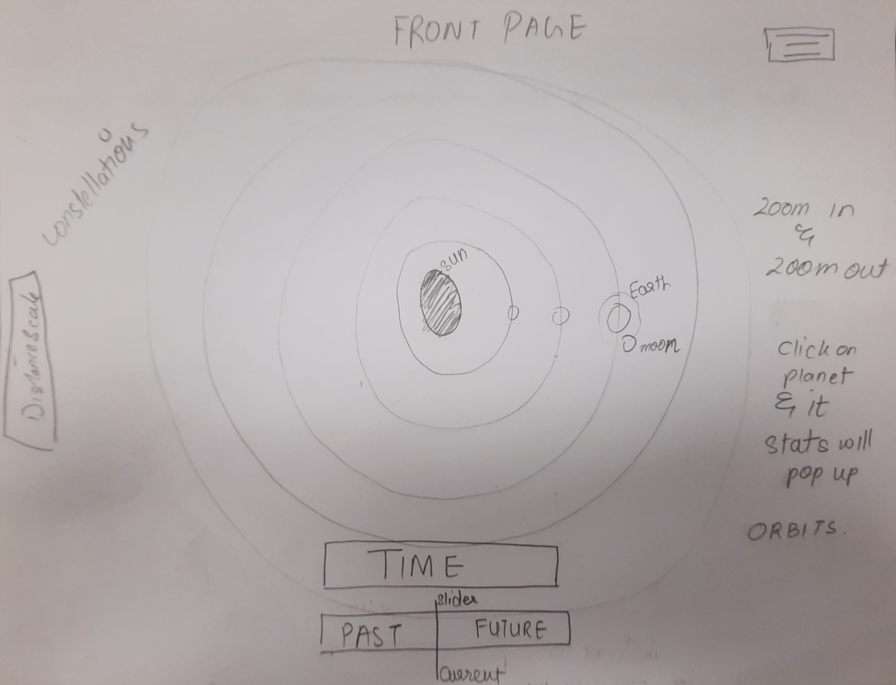
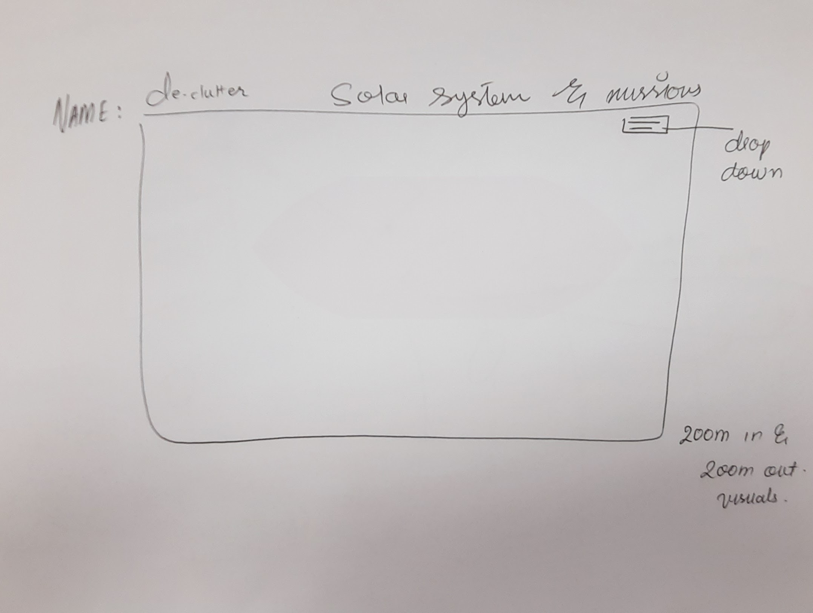
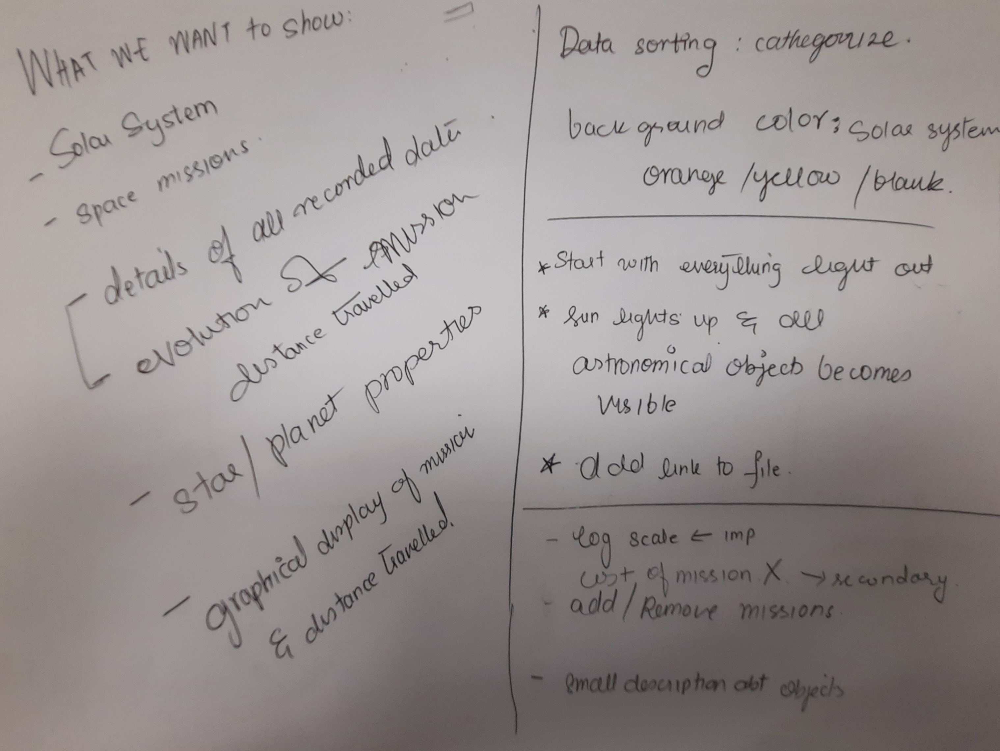

# Project Proposal

## Title: Astronomy Visualization [title in progress]

## Team Members

- Matthew Whitaker
	- email: matthew.whitaker@utah.edu
	- UID: 1251812

- Sarah Khan
	- email: sarah.khan@utah.edu
	- UID: 1531711

- Simón González
	- email: u1528314@utah.edu
	- UID: 1528314

## Background and Motivation

We aim to build a solar system exploration viewer focused on space missions data. Our target audience includes space enthusiasts and the general public, and we hope to provide deeper insights while inspiring greater interest in the subject. This choice of project reflects our personal interest and we believe it would also present an exciting technical challenge in visualization.

Public enthsiasm in space exploration has grown significantly in recent years, driven by scientific research, high-profile space missions and public engagement. This trend is reflected in the expanding body of academic research on the solar system and space vehicles, particularly after 2012 according to the [Hardvard Astrophysics Database System, 2024](https://ui.adsabs.harvard.edu/search/filter_keyword_facet_fq_keyword_facet=AND&filter_keyword_facet_fq_keyword_facet=keyword_facet%3A%22solar%20system%20general%22&filter_property_fq_property=AND&filter_property_fq_property=property%3A%22refereed%22&fq=%7B!type%3Daqp%20v%3D%24fq_database%7D&fq=%7B!type%3Daqp%20v%3D%24fq_keyword_facet%7D&fq=%7B!type%3Daqp%20v%3D%24fq_property%7D&fq_database=(database%3Aastronomy%20OR%20database%3Aphysics)&fq_keyword_facet=(keyword_facet%3A%22solar%20system%20general%22)&fq_property=(property%3A%22refereed%22)&p_=0&q=space%20exploration&sort=date%20desc%2C%20bibcode%20desc).
At the same time, some citizen science initiatives, such as NASA’s ["Backyard Worlds: Planet 9" project](https://www.nasa.gov/get-involved/backyard-worlds-planet-9/), have been intensely promoting public engagement and encouraging active involvement in space exploration.
We have to admit, we have been caught up in this wave of excitement ourselves, which isn’t surprising considering our background. Our group includes a Ph.D. student in astrophysics, a computer science graduate student developing software for astronomy research, and an electrical engineer who enjoys learning about spacecrafts and space exploration.

Also, with this project, we believe there is potential to improve how this kind of information is presented. Typically, visualizations focus on timelines and written milestones, omitting interesting information that could provide a more comprehensive understanding of the missions. For example, the paths, orbits and gravity assists commonly used, the different phases involved, spacecraft speeds, and the story of mission failures and crash landings.

## Project Objectives

### Primary questions to answer with the visualizations

#### The exploration frontier in the Solar System

We will answer questions related to the celestial bodies in the Solar System, making sure to include lesser-known objects and under-explored parts of our solar system: 
- What is the orbit location of solar system objects, including planets, dwarf planets, moons, asteroids, and belts?
- What is the date of discovery for these objects, and what are the most recently discovered celestial bodies?
- How has the number of discovered moons around each planet changed over time?

#### The History and Impact of Space Exploration Missions
Also, we aim to portray data related to the history and technical aspects of space missions.

- What are the most common targets for space missions in terms of planets, moons, or other celestial bodies?
- What is the success and failure ratio of missions sent to specific objects?
- How many shuttles, artificial satellites, and probes are currently in operation, and how that number has changed over time?
- What are the times and locations of different mission phases?
- What are some regular paths traversed by the different missions in the solar system?
- Which celestial objects are commonly used for gravity assists and orbiting?

### Benefits

Some benefits of this project include:

- This project provides the opportunity to work with real-world space mission data, which we have not previously explored despite our backgrounds. This will help us **deepen our understanding of planetary science and mission dynamics**.

- Space exploration data is more complex than typical astronomical data due to the involvement of human activity. We think this makes space exploration data well-suited for **practicing visual storytelling and tackling technical visualization challenges**.

- By making space mission data more accessible, this project could help **broaden interest in space exploration among the general public** and enthusiasts.

## Data

The primary data source for this project is the [General Catalog of Artificial Space Objects](https://planet4589.org/space/gcat/) (GCAT), published and maintained by Jonathan C. McDowell, an astrophysicist at the Harvard-Smithsonian Center for Astrophysics.
The data is stored in a set of ~20 relational-database-style tables available for download at the link above (the full catalog is only ~10 MB).

The data is updated regularly (a couple times a week). Data is compiled from a variety of archives, government sources, observations by astronomers, and launch/orbital information provided by private companies.

For this project, we'll primarily use the following tables:

 - [Organizations Database](https://planet4589.org/space/gcat/web/orgs/index.html) (A list of government, educational, and private organizations involved in space flight)
 - [Launch Vehicles](https://planet4589.org/space/gcat/web/lvs/index.html) (A list of vehicles used for spaceflight)
 - [Launch Lists](https://planet4589.org/space/gcat/web/launch/index.html) (A table of launches)
 - [Worlds in the Solar System](https://planet4589.org/space/gcat/web/worlds/index.html) (A collection of information about planetary bodies and their major natural satellites in the Solar System)
 - [Object Catalogs](https://planet4589.org/space/gcat/web/cat/index.html) (A collection of several subtables)

Since the GCAT's scope is primarily artificial objects, the "Worlds in the Solar System" table is incomplete, containing only basic information about major Solar System bodies. We'll supplement the data with data from [NASA JPL's Horizons data system](https://ssd.jpl.nasa.gov/horizons/), which has a [public REST API](https://ssd-api.jpl.nasa.gov/doc/horizons.html) and their [tables of information about Planetary Satellites](https://ssd.jpl.nasa.gov/sats/).

## Data Processing

### Data Cleaning

Data cleaning will be relatively straightforward, since the data is already in a well-defined format. We will need to write custom code to parse Jonathan McDowell's "Vague Date" format. The primary way we process the data will be through database-style table joins, filters, and aggregations to show only the relevant relationships.

### Derived Data

There are a few quantities that we are interested in that aren't stored explicitly in the data:

- **Space Junk:** Our data doesn't include details about which objects have been left in space as junk. Using some basic heuristics (e.g. time since last state change, object type) we can define which objects are space junk to get interesting insights into the generation of space junk over time.
- **Trajectories:** Our data is primarily a list of objects and then a list of state-changes for those objects. For example, a Lunar Lander might be the primary object. It is installed on a rocket, launched from a launch site, detached from the lunar orbiter, landed on the moon, re-launched from the moon, etc. Each change the object goes through is stored as a row in the event table.
We will need to convert these lists of events (which contain timing and orbital data) into trajectories or locations that might be plotted on a map. This will also allow us to calculate distances between objects, for example.

### Implementation

Since each table has a text-based ID, the data processing described above can be implemented in JavaScript by converting the TSV tables to maps of IDs to JSON objects containing the data attributes for each row. We can then write functions to derive the data described above.

## Visualization Design

### Sketches

#### Sketch 1: Sarah's sketches

#### Sketch 2: Matthew's sketches

#### Sketch 3: Simón's sketches

### Final Design

### Justification of visual encodings

#### Home page

This section will show a map of the solar system, and will be the main visualization for the project. Its main goal is to show the location and orbits of objects in the solar system and the paths of space missions. The visual encodings used in this page are:

 - **Object position at current epoch**: encoded with a filled circle located spatially with logarithmic position (x and y) relative to central object. The logarithmic scale allows us to display more data in a smaller space, since the solar system is very spread out.
 - **Object orbit**: encoded spatially with ellipse with radius following logarithmic distance scale relative to central object.
 - **Object information (name, description)**: encoded with text visible when hovering over object. This allows us to show more information than can be shown on the screen at one time.
 - **Mission data**: encoded with curved path representing the actual trajectory of mission.
 - **Mission information (name, description)**: encoded with text visible when hovering over mission path.
 - **Mission important events (e.g. phase changes)**: encoded with points located at the site of the event. When hovering over these points, a box will open up with the event name and description.
 - **Number of missions to each object**: When multiple mission paths overlap, only one line will be shown, with an increased width or opacity. This allows us to show a lot of missions in a limited space and encode the most comon routes.
 - **Object average color**: We will encode the objects with an appropriately colored circle, allowing us to compare and distinguish the planets and moons visually. If time, we may replace color with an actual image of the object.
 - **Object radius**: Encoded logarithmically as the radius of the object's circle. This allows us to show the relative size of objects in the solar system.
 - **Object type**: Encoded as an outline around the object's circle: dashed for moons, solid for planets, and dotted for asteroids. This allows us to quickly see the type of object (and adds contrast against the background).
 - **Distance scale**: Represented with a logarithmic axis from the center of the view to the right and left. This visually encodes the current zoom level and allows a quick reference of how far away an object is from the central object.

#### Data Viewer Page

This section will show a scatter plot to easily visualize relationships, for example, the distance achieved by missions over time. The visual encodings used in this page are:

 - **Data selection**: Encoded with dropdowns for each axis. This allows the user to select the data they want to see on each axis.
 - **Data scale**: Encoded with a checkbox for each axis. This allows the user to switch between a linear and logarithmic scale.
 - **Data points**: Encoded as points on the scatter plot. This allows the user to see the data points and compare them to each other.
 - **Data point information**: Encoded as a box that appears when hovering over a data point. This allows the user to see the name of the data point and its value.

## Must-Have Features

- Map of solar system, including:
  - Logarithmic Scale.
  - Ability to zoom in and out.
  - Ability to tilt in 3d (at least on one axis).
  - Location of Solar System objects.
  - Orbits of Solar System Objects.
  - Information box that appears when hovering over data point with:
    - Name
    - Description
- Visualization of deep-space (to the Moon or farther) missions over time throughout the Solar System.
  - Number of missions encoded in width or transparency of line
  - Important points in mission notated.
- Ability to plot many quantities from our data on a second scatter plot
  - User can select data and scale for each axis.

## Optional Features

- Time slider to show progression of positions and data over time.
- Tilt in more than one 3d axis.
- Images of planets instead of filled figures.
- More details about planets in the information box:
    - Kind: planet / moon
    - Temperature
    - Distance from Earth
- Ranking chart to compare data for different missions and objects as shown in the third sketch.
- Side-by-side comparison of different solar system objects as shown in the second sketch.
- Show additional data for missions (costs, images taken, countries). Some of this information is publicly available but only for selected missions.
- Additional information for asteroids such as probability of collision with Earth.
- Location or quantity of space Junk generated by each mission.
- Near-earth space missions (e.g. missions to/from ISS, Starlink satellites in orbit).

## Project Schedule [Sarah]

Following are the  detailed task schedule.
Note: The task list is divided week-wise, which includes week 1-4 timeline. Additionally, there are some week overlaps to account for continuous work.

---

### **Week 1-4: Project Initialization and Planning**
#### **Task 1: Project Team Formation & Initial Brainstorming**
- **Objective:** Define goals for visualizing the solar system and space missions.
- **Visual Encodings:**
  - Discuss and decide why logarithmic scales will be used to show distances and object sizes.
  - Identify specific needs for visualizing object types (planets, moons, asteroids) using different outlines.
  
#### **Task 2: Project Proposal Development**
- **Objective:** Develop a proposal that outlines the project’s visualization goals.
- **Visual Encodings:**
  - Draft sketches of the visual design and how data will be represented. Three sketches as prototype from each team member and one final draft design. 
  - Finalize choices for encoding information through colors, shapes, lines (e.g., mission paths using varying opacity/width).
  - Explain what text on hover will be used for object information and mission data.
  
#### **Task 3: Assignment of Tasks**
- Assign roles for data acquisition, visual design, and interactive features.
  
---

### **Week 5-6: Project Review & Data Exploration**
#### **Task 1: Data Exploration**
- **Objective:** Identify the datasets to visualize (e.g., positions of objects, mission data).
- **Visual Encodings:**
  - Explore how the chosen data will affect visual encodings like object size, trajectory lines, and hoverable text.
  - Decide on the logarithmic distance scaling implementation.
  
#### **Task 2: Project Review Meeting**
- **Objective:** Review visual encodings and discuss any needed changes.
- **Deliverable:** Clear explanation of why each encoding (e.g., color, size, orbit) was chosen.

---

### **Week 4-7: Data Acquisition and Visualization Prototype**
#### **Task 1: Data Collection and Cleaning**
- Gather data on solar system objects, missions, and their paths.
  
#### **Task 2: Data Structure Implementation**
- Define how data will be structured to support visual encodings (logarithmic scale, orbit paths, object color, etc.).

#### **Task 3: Prototype Development**
- Develop a working visualization of the solar system map, showing initial visual encodings.
- **Visual Encodings:**
  - Begin testing interactive elements like hover states for information and zooming with logarithmic scaling.
  
---

### **Week 8: Milestone Submission**
#### **Task 1: Prepare Code and Documentation**
- Submit the working visualization with initial visual encodings.

#### **Task 2: Milestone Release on GitHub**
- Ensure documentation explains each visual encoding, especially the use of the logarithmic scale, hover states, and path representation.

---

### **Week 9: Peer Feedback**
#### **Task 1: Provide Feedback**
- Focus on how clear the visual encodings are in peer projects.
  
#### **Task 2: Review Peer Feedback**
- Incorporate feedback on your visual encodings to improve clarity and accuracy.

---

### **Week 10-11: Finalization and Refinement**
#### **Task 1: Complete Website Development**
- Finalize the website, ensuring all interactive features (hover text, zoom, etc.) work as intended.

#### **Task 2: Finalize Visual Encodings**
- Ensure each visual element (size, orbit, mission paths, text on hover) clearly communicates the necessary information.
- **Visual Encodings:**
  - Final the size, color, and logarithmic distance scales for clear representation.

#### **Task 3: Process Book and README**
- Document visual encoding decisions in the process book and README.

#### **Task 4: Record Screencast**
- Create a screencast video, explaining how visual encodings enhance the user experience and visualization effectiveness.

---

### **Week 12: Final Submission & Presentation**
#### **Task 1: Final GitHub Release**
- Ensure all code, justifications for visual encodings, and documentation are complete.

#### **Task 2: Host Website**
- Ensure the hosted website clearly demonstrates the visual encodings and interactive features.

#### **Task 3: Embed Screencast Video**
- Explain how visual encodings enhance user understanding of the data in the video.

#### **Task 4: Submit Group Feedback**
- Provide feedback on group collaboration, including discussion on visual encoding choices.

---

