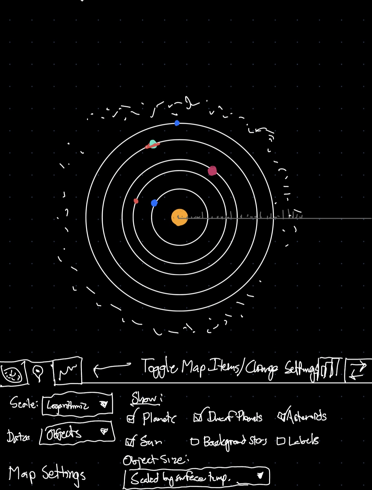
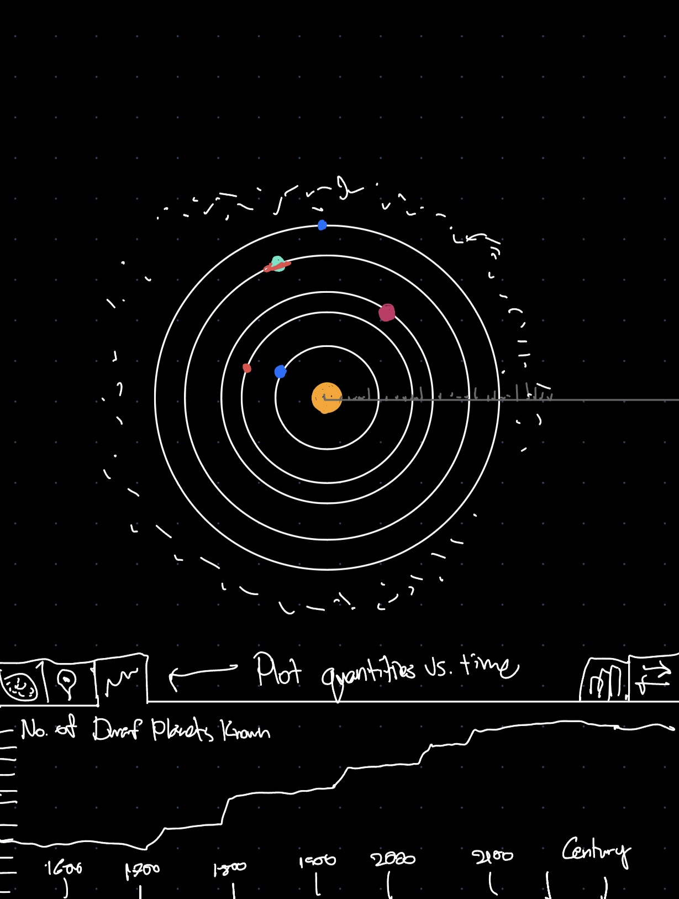
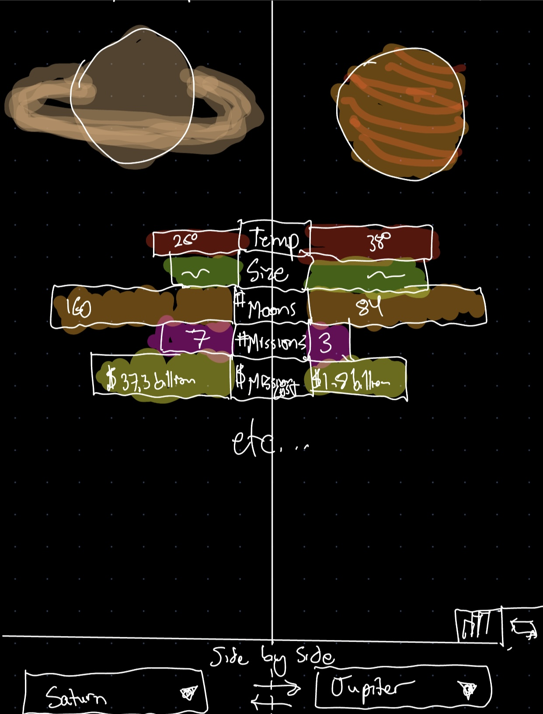
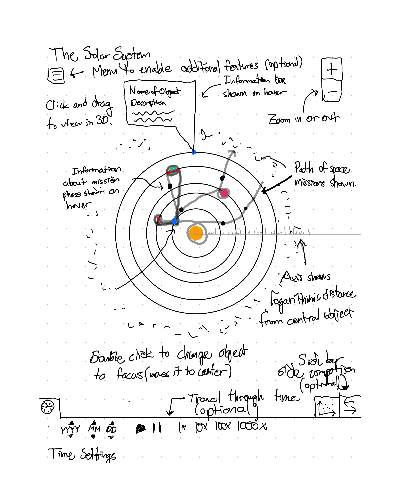

# Project Proposal

## Title: Astronomy Visualization [title in progress]

## Team Members

- Matthew Whitaker
	- email: matthew.whitaker@utah.edu
	- UID: 1251812

- Sarah Khan
	- email: sarah.khan@utah.edu
	- UID: 1531711

- Simón González
	- email: u1528314@utah.edu
	- UID: 1528314

## Resources

* [Project Ideas Document](https://docs.google.com/document/d/1pG8MIJ63O_l-x5lxE9TWMq5bsQBWVphontCbd75LPDg/edit?usp=sharing) contains the initial questions and design ideas. 
* [Project proposal assignment (Due next Friday Sept 13)](https://www.dataviscourse.net/2024/project/#project-proposal)
* [Link for data review](https://planet4589.org/space/gcat/index.html): use this to get an idea of what data is available to design the visualizations.

## Background and Motivation [Simón][Work in progress][Subtitles are just for organizing, it will be a continuous text]

We aim to provide visualizations for individuals interested in space exploration, offering more depth than typical surface-level representations. Our target audience includes the general public curious about space who seek deeper insights into space exploration missions. We hope the visualizations produced could serve to inspire greater interest in the subject. This choice of topic aligns with personal and current public interest in space exploration and leverages the opportunities for applying different visualization techniques, aided by the broad availability of relevant data.

#### Part 1: Public & Personal interest

Public interest in space exploration has grown significantly in recent years, driven by scientific research, high-profile space missions and increasing public engagement. This trend is reflected in the expanding body of academic research on the solar system and space vehicles, particularly after 2012, with a notable increase in publications after 2019 (cite ADS).
At the same time, some citizen science initiatives, such as NASA’s "Backyard Worlds: Planet 9" project (cite), have been intensely promoting public engagement and encouraging active participation and involvement in space exploration.
Furthermore, the projected economic growth of the space industry, estimated to reach $1.8 trillion by 2035 (cite), highlights the significance of space exploration as space technologies like satellite communications and climate monitoring continue to impact daily life.
Aside from selecting space exploration data for its current relevance and public interest, our team has a strong connection to astronomy and space science. We include a Ph.D. student in astrophysics, a computer science graduate student involved in supporting astronomy research through software development, and an electrical engineer with a keen interest in the design and engineering of instruments and spacecraft.

#### Part 2: Data Availability & Opportunities

Also, astronomy data is vast and highly accessible, offering us the flexibility to choose from a wide range of attributes for our visualizations. This will allow us to apply different concepts we learn in our data visualization course.

We believe there is potential to improve how this kind of information is presented. Typically, visualizations focus on timelines, target planets, orbit representations, written milestones and distances from Earth (images). While this data is useful, it often omits interesting information that could provide a more comprehensive understanding of the missions. For example, the phases involved in traveling to different targets, spacecraft weights and speeds, mission failures and crash landings, **the investment required**, debris generated, and objects used for gravity assists. **Also, to emphasize the value of space exploration, we believe that including measurements of the missions' scientific value, such as the number of pictures captured or the scientific objectives achieved, would be highly insightful**.

## Project Objectives [Simón]

### Primary questions to answer with the visualizations

#### Part 1: The exploration frontier in the Solar System

We will answer questions related to the celestial bodies in the Solar System with an emphasis in lesser-known objects and under-explored parts of our solar system. 
- What is the orbit location of solar system objects, including planets, dwarf planets, moons, asteroids, and belts?
- **Which planets, moons, asteroids, or regions have been the least explored in terms of missions, measurements, or images?**
- What is the date of discovery for these objects, and what are the most recently discovered celestial bodies?
- How has the number of discovered moons around each planet changed over time?
 - **How many registered asteroids are currently orbiting or residing within the solar system, and what is their location? What is the probability of impact with Earth for any of these asteroids?**
- **What are the proposed locations of hypothetical (debunked or otherwise) celestial objects within the solar system?**

#### Part 2: The History and Impact of Space Exploration Missions
We aim to portray data related to the history, technical aspects, cost and value value of space missions.

- What is the history of space exploration missions and launches?
    - Number of missions by target (planet, moon, etc.), distance traveled, duration, and the country of origin.
    - What is the success and failure ratio of missions sent to specific objects?
    - **What are the most common causes of failure for these missions?**
- Current artificial space objects:
    - How many shuttles, artificial satellites, and probes are currently in operation within the solar system, and how has this number changed over time?
- What is the scientific value of space exploration?
    - **What are the most and least prolific missions in terms of scientific papers published?**
    - **Which space missions have been the most prolific in terms of measurements, images, and data produced from celestial objects in the solar system?**
- What is the cost of space exploration?
    - **How much investment has been made in space missions, and how does this relate to the target object, distance, duration, and the country responsible for the mission?**
    - **Which missions were the most and least costly?**
- Mission technical details:
    - **What speeds have been achieved by different space missions?**
    - What are the times and locations of different mission phases?
    - **How much space junk has been generated by these missions, and where is it located?**
    - What are some regular paths traversed by the different missions in the solar system?
    - **What objects are commonly used for gravity assists during space missions?**

### Learning / Accomplishment goals / benefits

## Data

The primary data source for this project is the [General Catalog of Artificial Space Objects](https://planet4589.org/space/gcat/) (GCAT), published and maintained by Jonathan C. McDowell, an astrophysicist at the Harvard-Smithsonian Center for Astrophysics.
The data is stored in a set of ~20 relational-database-style tables available for download at the link above (the full catalog is only ~10 MB).

The data is updated regularly (a couple times a week). Data is compiled from a variety of archives, government sources, observations by astronomers, and launch/orbital information provided by private companies.

For this project, we'll primarily use the following tables:

 - [Organizations Database](https://planet4589.org/space/gcat/web/orgs/index.html) (A list of government, educational, and private organizations involved in space flight)
 - [Launch Vehicles](https://planet4589.org/space/gcat/web/lvs/index.html) (A list of vehicles used for spaceflight)
 - [Launch Lists](https://planet4589.org/space/gcat/web/launch/index.html) (A table of launches)
 - [Worlds in the Solar System](https://planet4589.org/space/gcat/web/worlds/index.html) (A collection of information about planetary bodies and their major natural satellites in the Solar System)
 - [Object Catalogs](https://planet4589.org/space/gcat/web/cat/index.html) (A collection of several subtables)

Since the GCAT's scope is primarily artificial objects, the "Worlds in the Solar System" table is incomplete, containing only basic information about major Solar System bodies. We'll supplement the data with data from [NASA JPL's Horizons data system](https://ssd.jpl.nasa.gov/horizons/), which has a [public REST API](https://ssd-api.jpl.nasa.gov/doc/horizons.html) and their [tables of information about Planetary Satellites](https://ssd.jpl.nasa.gov/sats/).

## Data Processing

### Data Cleaning

Data cleaning will be relatively straightforward, since the data is already in a well-defined format. We will need to write custom code to parse Jonathan McDowell's "Vague Date" format. The primary way we process the data will be through database-style table joins, filters, and aggregations to show only the relevant relationships.

### Derived Data

There are a few quantities that we are interested in that aren't stored explicitly in the data:

- **Space Junk:** Our data doesn't include details about which objects have been left in space as junk. Using some basic heuristics (e.g. time since last state change, object type) we can define which objects are space junk to get interesting insights into the generation of space junk over time.
- **Trajectories:** Our data is primarily a list of objects and then a list of state-changes for those objects. For example, a Lunar Lander might be the primary object. It is installed on a rocket, launched from a launch site, detached from the lunar orbiter, landed on the moon, re-launched from the moon, etc. Each change the object goes through is stored as a row in the event table.
We will need to convert these lists of events (which contain timing and orbital data) into trajectories or locations that might be plotted on a map. This will also allow us to calculate distances between objects, for example.

### Implementation

Since each table has a text-based ID, the data processing described above can be implemented in JavaScript by converting the TSV tables to maps of IDs to JSON objects containing the data attributes for each row. We can then write functions to derive the data described above.

## Visualization Design

### Sketches

#### Sketch 1 [Sarah]

#### Sketch 2 [Matthew]

#### Sketch 3 [Simón]

### Final Design

### Justification of visual encodings [Matthew]

## Must-Have Features

- Map of solar system, including:
  - Logarithmic Scale
  - Ability to zoom in and out
  - Ability to tilt in 3d (at least on one axis)
  - Location of Solar System objects
  - Orbits of Solar System Objects
  - Information box that appears when hovering over data point
    - Name
    - Description
- Visualization of deep-space (to the Moon or farther) missions over time throughout the Solar System
  - Number of missions encoded in width or transparency of line
  - Important points in mission notated
- Ability to plot many quantities from our data on a 2d scatter plot
  - User can select data and scale for each axis

## Optional Features

- Time slider to show progression of positions and data over time
- Tilt in more than one 3d axis
- Images of planets
- More details about planets:
    - Kind: planet / moon
    - Temperature
    - Distance from Earth
- Ranking chart to compare data for different missions and objects
- Side-by-side comparison of different solar system objects
- Show additional data for missions (costs, images taken, countries)
- Additional information for asteroids
- Space Junk generated by each mission
- Near-earth space missions (e.g. missions to/from ISS, Starlink satellites in orbit)

## Project Schedule [Sarah]

